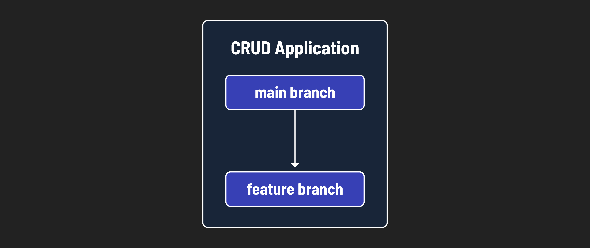
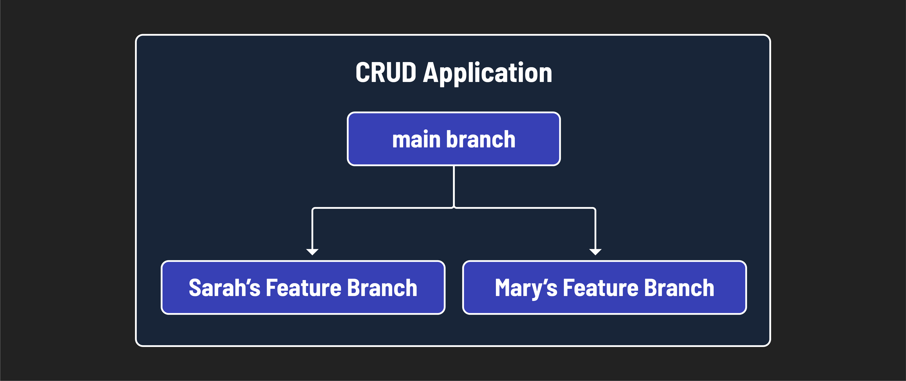

# 

**Learning objective:** By the end of this lesson, students will be able to tktk.

We've forked and cloned a repository, and now we're ready to start working on it. But how do we manage our changes and collaborate with others? This is where branching and working with branches come in. Branching is a feature of Git that allows you to create separate lines of development within a repository. Each branch represents an independent line of development, allowing you to work on different features, bug fixes, or experiments without affecting the main codebase. 

Imagine you have a single code base. It's a full CRUD application that is deployed and people have been interacting with it through the web. You want to add a new feature, but you're not sure if it will work. You don't want to break the main codebase, so you **create** and **checkout** to a new branch. 



> 🧠 Branching is like creating a parallel universe where you can experiment with new features, fix bugs, or refactor code without affecting the main codebase.

Branching can also be used to collaborate with others on a shared codebase. Each developer can work on a separate branch, making changes and testing new features independently. Once the changes are complete, they can be merged back into the main codebase through a pull request.



> 📖 We will talk about merging and pull requests in the next lessons.

## Creating and Naming a Branch

Let's create a new branch on the repository we forked and cloned in the previous lesson. We'll name the branch `feature/new-feature-one`. In your terminal, make sure you are in the forked and cloned repository directory:

```bash
git branch feature/new-feature-one
```

This command creates a new branch named `feature/new-feature-one`. Let's view the list of branches to confirm that the new branch was created:

```bash
git branch
```

You should see a list of branches, with an asterisk (`*`) next to the branch you are currently on. To switch to the new branch, use the `checkout` command:

```bash
git checkout feature/new-feature-one
```

If you use the `git branch` command again, you should see the asterisk next to the new branch, indicating that you are now on the `feature/new-feature-one` branch.

You've created a new branch! 🎉

### Branch Naming Conventions

Before we go any further, let's talk about branch naming conventions. Branch names should be descriptive and follow a consistent format. Here are some common branch naming conventions:

- `dev`: Used for the main development branch.
- `feature/`: Used for new features or enhancements.
- `bugfix/`: Used for bug fixes.
- `hotfix/`: Used for critical bug fixes that need to be deployed immediately.
- `refactor/`: Used for refactoring code.
- `release/`: Used for preparing a new release.
- `docs/`: Used for documentation changes.
- `test/`: Used for adding or modifying tests.
- `chore/`: Used for miscellaneous tasks or maintenance.

By following a consistent naming convention, you can easily identify the purpose of each branch and maintain a clean and organized codebase. 

> 🧠 Branches like `feature/sign-in`, `bugfix/home-page-error`, and `refactor/cat-show-component` are using the naming convention to the fullest potential.

## Parrallel Universe - Branches

When we forked and cloned down our partners repository we were given a `main` branch by default. Then `main` branch will always be present in a repository. And when we used the `git branch feature/new-feature-one` command we created another branch using the `main` branch as a starting point. This means that all the files and code that are in the `main` branch are also in the `feature/new-feature-one` branch. Let's open up our repository with VSCode and take a look at the branches in action. In your terminal, navigate to the repository directory and run the following commands:

```bash
git checkout feature/new-feature-one
code .
```

Create a new file called `parallel-universe.md` and add the following content:

```md
Welcome to the parallel universe of branches!
```

Stage and commit the changes:

```bash
git add .
git commit -m "Added parallel universe file"
```

Now checkout to the `main` branch and take a look at the file again. 

```bash
git checkout main
```

The contents are gone! This is because the file was created on the `feature/new-feature-one` branch. The `main` branch does not have the file because the changes were made on a separate branch. This is the power of branching. You can make changes to a branch without affecting the main codebase.

Check back out to the feature branch:

```bash
git checkout feature/new-feature-one
```

The file is back! 🎉

> You can switch between the branches as many times as you want. The changes you make in one branch will not affect the other branches.

## Remote Vs. Local Branches

As of right now everything we have done is locally on our machine. On GitHub, we have a remote repository that we forked and cloned. When we created the `feature/new-feature-one` branch we created a local branch. This means that the branch only exists on our machine. To make the branch available on GitHub we need to push the branch to the remote repository. Let's do that now. In our terminal run the following command:

```bash
git push origin feature/new-feature-one
```

The `git push` command takes two arguments:

- The remote repository (`origin`)
- The branch you want to push (`feature/new-feature-one`)

> The `origin` is the default name for the remote repository. When you clone a repository, Git automatically creates a remote called `origin` that points to the original repository on GitHub. We will be looking at how to change or add remote repository locations in a later lesson.

Now if you go to the repository on GitHub and click on the `main` branch you will see that there is a `feature/new-feature-one` branch.
