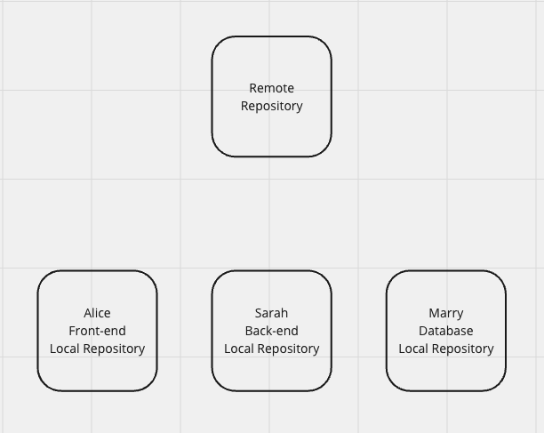
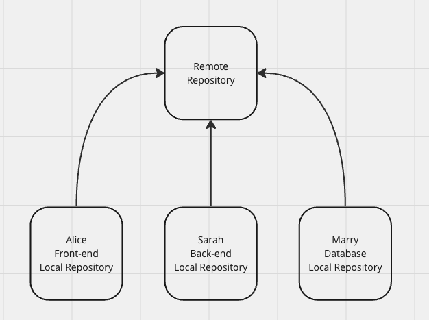

# 

**Learning objective:** By the end of this lesson, students will be able to tktk.

## Collabarative Coding

Let's say you are working on a project with a team of developers. Each developer is responsible for a different part of the project. Alice is working on the front-end, Sarah is working on the back-end, and Mary is working on the database.

tktk Hunter - Can you make this pretty? :)

Each of them writes their code independently, but their work needs to be integrated to create a functional application. How do you ensure that everyone's work is integrated seamlessly? This is where collaborative coding comes in. Collaborative coding is the practice of multiple developers working together on a shared codebase. It involves using tools like Git and GitHub to manage changes, track versions, and merge contributions from different team members.

tktk Hunter - Can you also make this one pretty?

## Collabarative Coding on GitHub

So far we have used Git and GitHub to manage our own work. However, Git and GitHub are also powerful tools for collaborating with others on a shared codebase. Let's take a high-level look at how collaborative coding works on GitHub. Before we dive completely into the world of collaborative coding on GitHub, it's important to know that GitHub is not the only platform for collaborative coding. There are other platforms like GitLab and Bitbucket that offer similar features. However, GitHub is the most popular platform for open-source projects and has a large community of developers.

**So, why GitHub?**

GitHub's popularity as a version control platform can be attributed to several key features:

- **Early Adoption and Network Effect:** GitHub was one of the first platforms to offer a user-friendly interface for Git. Its early adoption and large user base have made it the go-to platform for many developers.
- **User-Friendly Interface:** GitHub's intuitive interface makes it easy for developers to manage repositories, track changes, and collaborate with others.
- **Intergration with Other Tools:** GitHub integrates with a wide range of tools and services, making it easy to automate workflows and streamline development processes.
- **Community and Collaboration:** GitHub's large community of developers and open-source projects fosters collaboration, knowledge sharing, and innovation.
- **Visibility and Discoverability:** GitHub's public repositories allow developers to showcase their work, contribute to open-source projects, and build a portfolio of projects.

During this lesson we are going to deep dive into using GitHub for collaborative coding.