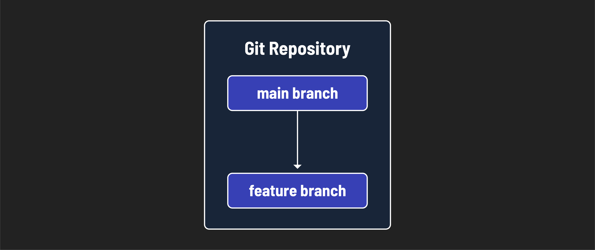
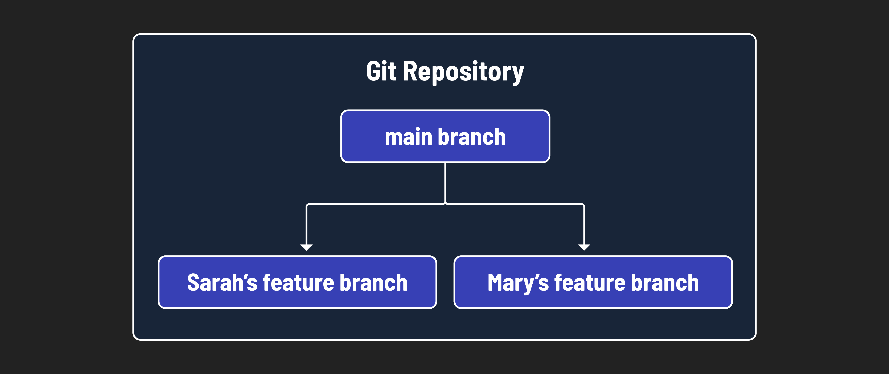
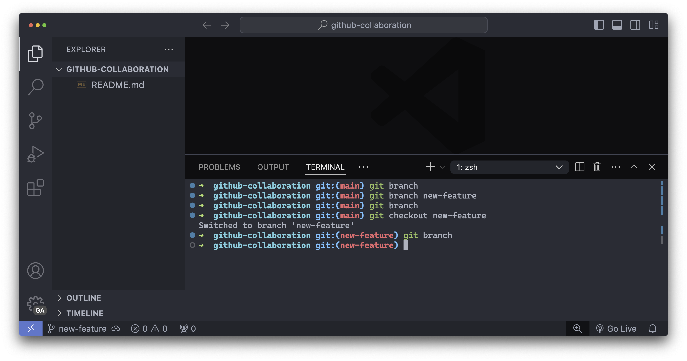
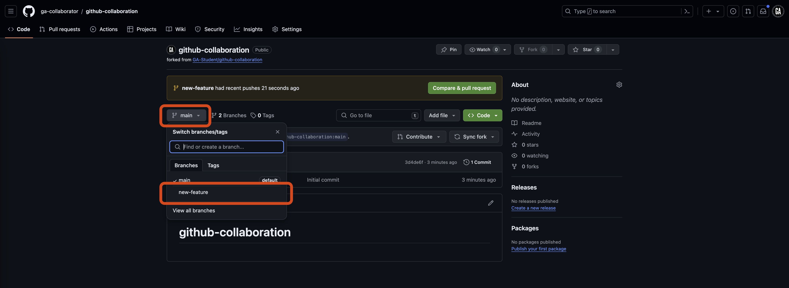

# 

**Learning objective:** By the end of this lesson, students will be able to create and work in branches.

## Branching

We've cloned the repository and are ready to start working on it. But how do we manage our changes and collaborate with others? This is where branching and working with branches come in.

You might already be familiar with the `main` branch of a repository. This is the default branch for a repo created on GitHub. It represents the main line of development on an application and is typically considered the most up-to-date source of truth for code in a repository. It has its own history, allowing you to view how it has changed over time.

Collaboration requires more complex branching than this though. If everyone worked on the `main` branch, it would be challenging to keep it up-to-date and ensure everyone collaborating on a project had a source of truth to reference. Therefore, when you collaborate, you'll work in a feature branch.



Working in a branch allows you to create separate lines of development within a repository. This means you can work on different features, bug fixes, or experiments without affecting the code in the `main` branch. Each branch has its own history, allowing you to view how it has changed over time.

> 🧠 Branching is like creating a parallel universe where you can experiment with new features, fix bugs, or refactor code without affecting the main codebase. You can use branches even when you're working alone on a project - this is encouraged.

In the rest of this lesson, we'll use branching to collaborate with others on a shared codebase. Each developer will work on a separate branch, making changes and testing new features independently. Once the changes are complete, they can be merged into the main codebase through a pull request.

> 🧠 We will talk about merging and pull requests in later lessons.



## Creating and naming a branch (***GitHub managers*** and ***programmers***)

> ⚠️ Both ***GitHub managers*** and ***programmers*** should complete this task.

Open the terminal in VS Code.

Let's start by viewing the list of branches that exist in this repo with the `git branch` command:

```bash
git branch
```

You should see a list of branches (the only branch currently is the `main` branch) with an asterisk (`*`) next to the branch you are currently on (`main`).

Hit the `q` key to exit this view.

Let's create a new branch on the repository we cloned in the previous lesson. In your terminal, run the below command:

```bash
git branch new-feature
```

This command creates a new `new-feature` branch. Note that we separate words with the `-` character so that our branch names are kebab case.

Because we were in the `main` branch when we created it, it will be created using the `main` branch as the starting point.

> 🚨 When collaborating you will ***not*** write code in the `main` branch of a repsitory, ever. You will still interact with the `main` branch, but you will not write code there.

Let's view the list of branches to confirm that the new branch was created:

```bash
git branch
```

You should see a list of branches with an asterisk (`*`) next to the branch you are currently on (`main`).

Hit the `q` key to exit this view.

To switch to the new branch, use the below `checkout` command after modifying it:

```bash
git checkout <identifier>/new-feature
```

If you use the `git branch` command again, you should see the asterisk next to the new branch, indicating that you are now on the new `<identifier>/new-feature` branch.

Hit the `q` key to exit this view.

The prompt on your terminal should change as well. The screenshot below shows this flow.



You've created a new branch and moved into it! 🎉

To review:

- `git branch` shows all the current branches - the branch you are currently in is indicated by an asterisk (`*`).
- `git branch feature-name` will create a branch named `feature-name`. Use your identifier here to help prevent duplicates.
- `git checkout feature-name` will change the current branch to the `feature-name` branch.

## Branches are parallel universes (***GitHub managers*** and ***programmers***)

> ⚠️ Both ***GitHub managers*** and ***programmers*** should complete this task.

Let's simulate what it will look like as you contribute code to a project.

When we used the `git branch new-feature` command, we created another branch called `new-feature` using the `main` branch as a starting point.

This means all the files and code in the `main` branch were duplicated into the `new-feature` branch. From now on, any code we write will ***only exist in this feature branch***. Let's demo this.

Create a new markdown file with a name of your choice. ***Important: ensure you don't use the same file name as any of your collaborators.*** Add a line of content to the file.

Stage and commit the changes:

```bash
git add .
git commit -m "add parallel universe file"
```

Now checkout the `main` branch and look at the file again.

```bash
git checkout main
```

The file is gone! This is because the file was created on the `new-feature` branch. The `main` branch does not have the file because the changes were made on a separate branch. This is the power of branching. You can make changes to a branch without affecting the main codebase.

Check back out to the feature branch:

```bash
git checkout new-feature
```

Tab auto-completion can help you here!

The file is back! 🎉

> 🧠 You can switch between the branches as many times as you want. You'll need to commit any changes you wish to save on your current branch before switching to a new one. The changes you make in one branch will not affect the other branches.

## Remote vs. local branches (***GitHub managers*** and ***programmers***)

> ⚠️ Both ***GitHub managers*** and ***programmers*** should complete this task.

Currently, everything we have done is locally on our machine. On GitHub, we have a remote repository that we forked and cloned. When we created the `new-feature` branch, we created a local branch. This means that the branch only exists on our machine.

We need to push the branch to the remote repository to make it available on GitHub. Let's do that now. In your terminal, run the following command:

```bash
git push origin new-feature
```

The `git push` command takes two arguments:

- The remote repository (`origin`)
- The branch you want to push (`new-feature`)

> 💡 The `origin` is the default name for the remote repository. When you clone a repository, Git automatically creates a remote called `origin` that points to the original repository on GitHub.
>
> This has important implications:
>
> - The team member with the ***GitHub manager*** role will push to the original repo forked by the team members with the ***programmer*** role.
> - The team members with the ***programmer*** role will push to the repo that was created on their accounts, forked from the ***GitHub manager's*** original repo.

Navigate to the GitHub `github-collaboration` repo in your account. The URL will look like: `https://github.com/<your-username>/github-collaboration`. `<your-username>` (including the `<` and `>`) should be replaced with your GitHub username.

If you go to the repository on GitHub, you will see that there is now a `new-feature` branch.


