<h1>
  <span class="headline">GitHub Collaboration</span>
  <span class="subhead">Fork Method Cheat Sheet</span>
</h1>

## Intro

This document provides a GitHub collaboration cheat sheet for those using the forking method to collaborate on a project.

Note that there is very little explanation for what the commands/actions in this document specifically accomplish - refer back to the main lecture content for more thorough details.

Use the below table of contents to quickly go to the section you need.

## Content

- [](#)
  - [Intro](#intro)
  - [Content](#content)
  - [Setup (once for each project)](#setup-once-for-each-project)
    - [Create a GitHub repository (***GitHub manager***)](#create-a-github-repository-github-manager)
    - [Clone the repo (***GitHub managers***)](#clone-the-repo-github-managers)
  - [Forking (once for each project)](#forking-once-for-each-project)
    - [Fork the repo (***programmers***)](#fork-the-repo-programmers)
    - [Clone the repo (***programmers***)](#clone-the-repo-programmers)
  - [Working in branches (repeat for every new feature you add)](#working-in-branches-repeat-for-every-new-feature-you-add)
    - [Ensure you have the most recent code (***GitHub managers*** and ***programmers***)](#ensure-you-have-the-most-recent-code-github-managers-and-programmers)
      - [Merging (***GitHub managers***)](#merging-github-managers)
      - [Merging (***programmers***)](#merging-programmers)
    - [Creating and checkout a branch (***GitHub managers*** and ***programmers***)](#creating-and-checkout-a-branch-github-managers-and-programmers)
    - [Write code (***GitHub managers*** and ***programmers***)](#write-code-github-managers-and-programmers)
    - [Push to the remote repo (***GitHub managers*** and ***programmers***)](#push-to-the-remote-repo-github-managers-and-programmers)
  - [Creating a pull request (***GitHub managers*** and ***programmers***)](#creating-a-pull-request-github-managers-and-programmers)
    - [Comparing changes (***GitHub managers*** )](#comparing-changes-github-managers-)
    - [Comparing changes across forks (***programmers*** )](#comparing-changes-across-forks-programmers-)
    - [Open a pull request (***GitHub managers*** and ***programmers***)](#open-a-pull-request-github-managers-and-programmers)
  - [Merging remotely (***GitHub managers***)](#merging-remotely-github-managers)
  - [Merging locally (***GitHub managers*** and ***programmers***)](#merging-locally-github-managers-and-programmers)
    - [Create a new branch](#create-a-new-branch)
    - [Checkout an existing feature branch](#checkout-an-existing-feature-branch)
  - [Fixing merge conflicts (***GitHub managers*** and ***programmers***)](#fixing-merge-conflicts-github-managers-and-programmers)

## Setup (once for each project)

### Create a GitHub repository (***GitHub manager***)

> ⚠️ Only ***GitHub managers*** should complete this task.

Create a new ***public*** repository on [GitHub](https://github.com/) with a name of your choice.

***Important***: The repository should have some contents. If making a new repository, initialize it by adding a README file.

Through the rest of this cheat sheet, we'll refer to this as the ***GitHub manager's remote repo***.

Copy the URL to the ***GitHub manager's remote repo*** and distribute it to the programmers on your team.

### Clone the repo (***GitHub managers***)

> ⚠️ Only ***GitHub managers*** should complete this task.

Open your Terminal application and clone the repo to your device into an appropriate location.

We'll refer to this as the ***GitHub manager's local repo***.

## Forking (once for each project)

### Fork the repo (***programmers***)

> ⚠️ Only ***programmers*** should complete this task.

1. **Navigate to the repository**: The GitHub manager on your team should have already sent you a URL to access the ***GitHub manager's remote repo***. Open your browser and navigate there now.

2. **Fork the repo**: Select the **Fork** button near the top right corner of the page, as indicated by the red outline below.

   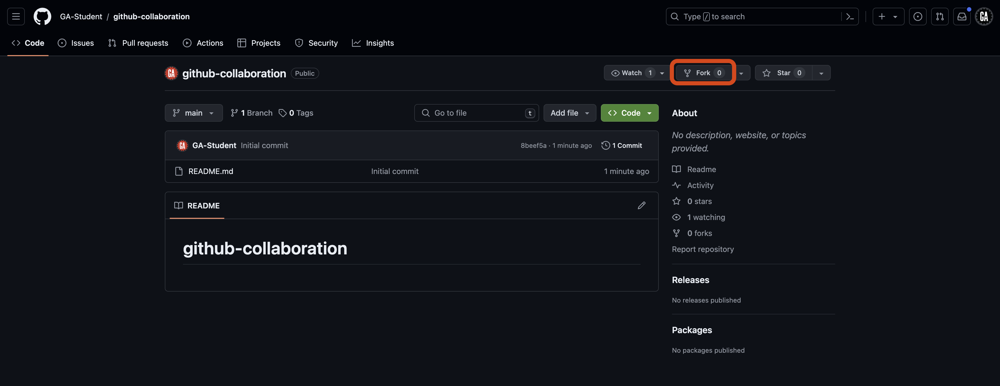

3. **Choose where to create the fork**: You'll be taken to a **Create a new fork** page. From here, ensure you are the owner of the repo in the dropdown outlined in red, and then select the **Create fork** button outlined towards the bottom of the page. Typically, when you fork a repo, you'll create the fork in your personal account and give it the same name as the original repo, as shown below.

   

After completing the above steps, you'll be taken to the forked repo on your account. Through the rest of this cheat sheet, we'll refer to this repo as the ***programmer's remote repo***. Note the **forked from** text outlined in red below, indicating that this repo was forked from another repo (the ***GitHub manager's remote repo***).

> 💡 Each programmer has their own remote repo - you'll only work in your own.

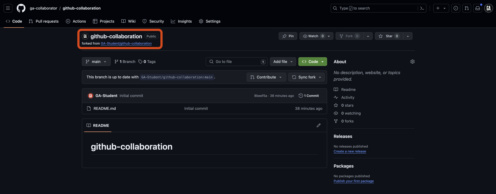

### Clone the repo (***programmers***)

> ⚠️ Only ***programmers*** should complete this task.

Open your Terminal application and clone the repo to your device into an appropriate location.

We'll refer to this as the ***programmer's local repo***.

## Working in branches (repeat for every new feature you add)

This is where the GitHub collaboration workflow begins. This step and the ones after it are ones you will complete repeatedly throughout a project. Your project should be open in VS Code.

### Ensure you have the most recent code (***GitHub managers*** and ***programmers***)

> ⚠️ Both ***GitHub managers*** and ***programmers*** should complete this task.

The steps to accomplish this will be slightly different if you are the ***GitHub manager*** or a ***programmer***. If you are a ***GitHub manager***, continue to the **Merging (*GitHub managers*)** section below. If you are a ***programmer***, skip to the **Merging (*programmers*)** section below.

#### Merging (***GitHub managers***)

> ⚠️ Only ***GitHub managers*** should complete this task.

First, return to your terminal in VS Code. If you have uncommitted work in a feature branch, commit your work first:

```bash
git add -A
git commit -m "meaningful commit message"
```

Checkout the `main` branch:

```bash
git checkout main
```

Then, pull the code from the `main` branch of the ***GitHub manager's remote repo***:

```bash
git pull origin main
```

Skip to the **Creating and checkout a branch** section below.

#### Merging (***programmers***)

> ⚠️ Only ***programmers*** should complete this task.

Navigate to your fork of the repo on GitHub (the ***programmer's remote repo***). It should be at this URL: `https://github.com/<your-username>/github-collaboration`.

> 🚨 Replace `<your-username>` (including the `<` and `>`) with your GitHub username.

If the `main` branch of your remote repo isn't up to date, you should see a section like the one outlined in red below. This indicates the `main` branch of your ***programmer's remote repo*** is out of date compared to the `main` branch of the ***GitHub manager's remote repo***:

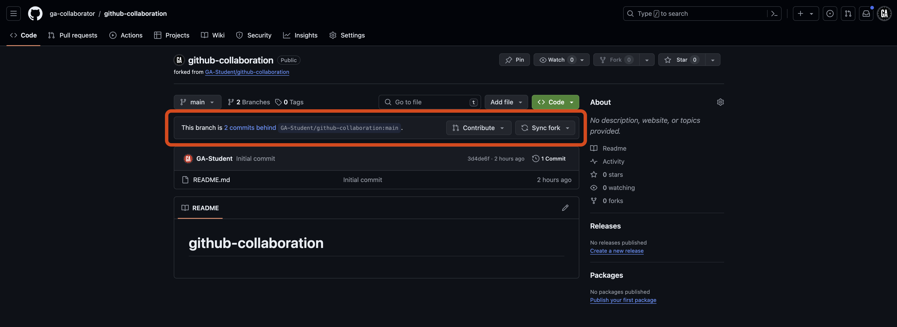

Bring it up to date by selecting the **Sync fork** button, followed by the **Update branch** button.

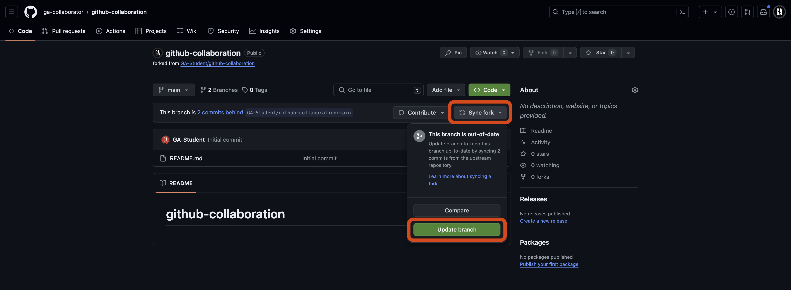

After a moment, the fork should update and indicate that it is up to date as shown below.

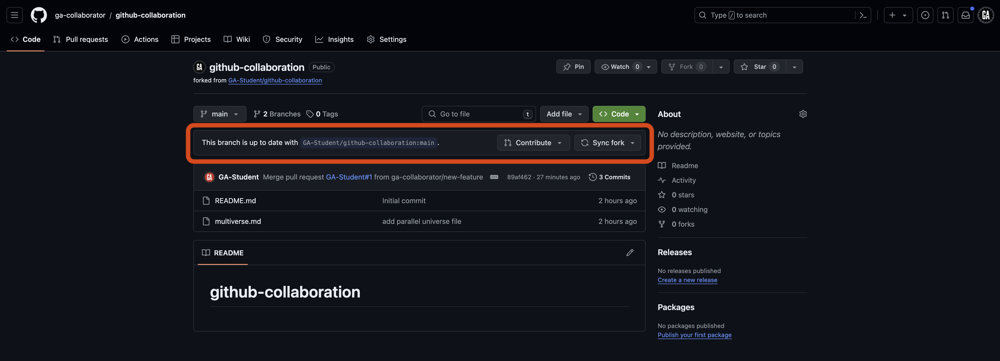

Return to your terminal in VS Code. If you have uncommitted work in a feature branch, commit your work first:

Checkout the `main` branch:

```bash
git checkout main
```

Then, pull the code from the `main` branch of your ***remote repo***:

```bash
git pull origin main
```

Continue to the **Creating and checkout a branch** section below.

### Creating and checkout a branch (***GitHub managers*** and ***programmers***)

> ⚠️ Both ***GitHub managers*** and ***programmers*** will do this.

Ensure you are in the `main` branch and have the most up to date code from the remote repository. You may need to commit the code in your current branch before you can switch to it.

```bash
git checkout main
git pull origin main
```

Modify the below command and run it to create a branch:

```bash
git branch <feature-branch-name>
```

> 🚨 Replace `<feature-branch-name>` (including the `<` and `>`) in the above command with an appropriate branch name identifying the feature that the branch implements.

Because we were in the `main` branch when we created it, it will be created using the `main` branch as the starting point.

> 🚨 When collaborating you will ***not*** write code in the `main` branch of a repsitory, ever. You will still interact with the main branch, but you will not write code there.

To switch to the new branch, use the below `checkout` command after modifying it:

```bash
git checkout <feature-branch-name>
```

> 🚨 Replace `<feature-branch-name>` (including the `<` and `>`) in the above command with an appropriate branch name identifying the feature that the branch implements.

### Write code (***GitHub managers*** and ***programmers***)

> ⚠️ Both ***GitHub managers*** and ***programmers*** should complete this task.

Write code as you normally would.

Stage and commit the changes:

```bash
git add -A
git commit -m "meaningful commit message"
```

### Push to the remote repo (***GitHub managers*** and ***programmers***)

> ⚠️ Both ***GitHub managers*** and ***programmers*** should complete this task.

We need to push the branch to the remote repository to make it available on GitHub. Let's do that now. In your terminal, run the following command after modifying it:

```bash
git push origin <feature-branch-name>
```

> 🚨 Replace `<feature-branch-name>` (including the `<` and `>`) in the above command with an appropriate branch name identifying the feature that the branch implements.

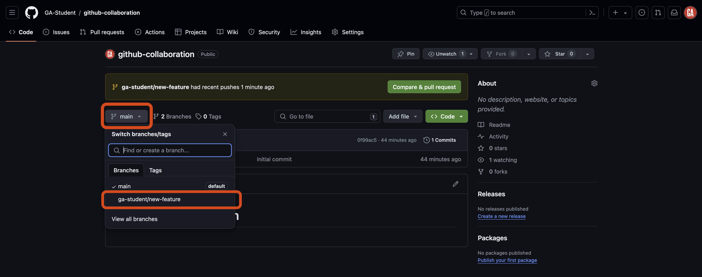

## Creating a pull request (***GitHub managers*** and ***programmers***)

> ⚠️ Both ***GitHub managers*** and ***programmers*** should complete this task.

There are many different methods to create a pull request on GitHub. The steps outlined below will ensure a repeatable and consistent experience in as few steps as possible.

You will need:

- The GitHub manager's GitHub username.
- The name of the repository you're working in.

Navigate to this URL after making the necessary changes to it:

```plaintext
https://github.com/<github-username>/<repo>/compare
```

Replacing `<github-username>` (including the `<` and `>`) with the GitHub manager's GitHub username and `<repo>` (including the `<` and `>`) with the repository name.

> 💡 When working on a project for a prolonged period, it is wise to bookmark this page for easy access!

You should arrive at a page similar to the one shown below.


There are two paths from here. Your role on your team will determine which path you take.

- ***GitHub managers***: Follow the instructions in the **Comparing changes** section below.
- ***Programmers***: Follow the instructions in the **Comparing changes across forks** section below.

### Comparing changes (***GitHub managers*** )

> ⚠️ Only ***GitHub managers***  should complete this task.

When you navigate to the pull request page, you will see the `Comparing changes` section. This section is where you will select the branches you want to compare. Two dropdowns in this section allow you to choose the base branch and the compare branch.

- **Base branch** - This is the branch you want to merge your changes into. This is typically the `main` branch.
- **Compare branch** - This is the branch you want to merge into the base branch. This is typically the feature branch you have been working on. In our case, it is `new-feature`. Note the arrow going from the **compare branch** to the **base branch** - this indicates the flow of your code.

You can see these dropdowns outlined in red in the screenshot below.


Select the **compare** dropdown, and select the branch you want to compare to the `main` branch. This is outlined in red in the screenshot below (although the branch name you want to compare to the `main` branch will be different). Note the search feature here - it may be necessary to use this when more branches are made in a repo.


After selecting a branch, you'll see the changes made if the pull request is merged. After you review the changes, select the **Create pull request** button outlined in red below.


Skip to the **Open a pull request** section below.

### Comparing changes across forks (***programmers*** )

> ⚠️ Only ***programmers*** should complete this task.

When you navigate to the pull request page, you will see the `Comparing changes` section.

We want to bring the code that currently only exists in your fork into the ***GitHub manager's*** repo. This means we need to compare across forks. Select the **compare across forks** link outlined in red below.


The UI below this link will change slightly. It should now look like the screenshot below. The area that has changed is outlined in red.


This section is where you will select the branches you want to compare. Four dropdowns, detailed below, allow you to choose the repositories and branches to compare.

- **Base repository** - This is the repository you want to contribute to. This should be the ***GitHub manager's remote repo***, which you originally forked from.
- **Base branch** - This is the branch you want to merge your changes into. This is typically the `main` branch.

It is unlikely that you will need to modify these from their default value. However, you will likely need to alter the next two dropdowns:

- **Head repository** - This is the repository you want to contribute code from. This is your own ***programmer's remote repo*** (forked from the GitHub manager's repository).
- **Compare branch** - This is the branch you want to merge into the **base branch**. This is typically the feature branch you have been working on. Note the arrow going from the **head repository**/**compare branch** to the **base repository**/**base branch** - this indicates the flow of your code.

Select the **head repository** dropdown, and choose the `<your-username>/github-collaboration` repository, replacing `<your-username>` (including the `<` and `>`). This is outlined in red in the screenshot below (although the repository name you want to use will be different).


Select the **compare** dropdown, and select the branch you want to compare to the `main` branch in the base repo. An example is outlined in red in the screenshot below, but yours will be different. Note the search feature here - it may be necessary to use this when more branches are made in a repo.


After selecting a branch, you'll see the changes made if the pull request is merged. The screenshot below shows that there will be one changed file. After you review the changes, select the **Create pull request** button outlined in red below.


Continue to the **Open a pull request** section below.

### Open a pull request (***GitHub managers*** and ***programmers***)

> ⚠️ Both ***GitHub managers*** and ***programmers*** should complete this task.

You'll be taken to a new page where you can open your pull request. Here, you will give your pull request a title and brief summary.

After setting up the title and description and selecting the branches you want to compare, select the **Create pull request** button as outlined in red below. This will create the pull request and take you to the pull request page.


## Merging remotely (***GitHub managers***)

> ⚠️ Only ***GitHub managers*** should complete this task. ***Technically***, any collaborator on the repository can complete this task, but many teams find it best to have one person in charge of this work to ensure a consistent experience.

On GitHub, navigate to the repository and select the **Pull requests** tab outlined in red below.

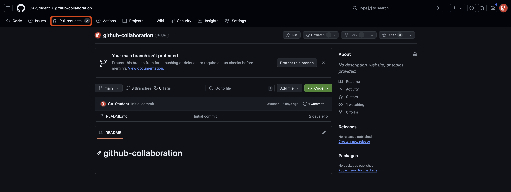

Once on the **Pull requests** tab, select an open pull request you would like to review as shown outlined in red below:

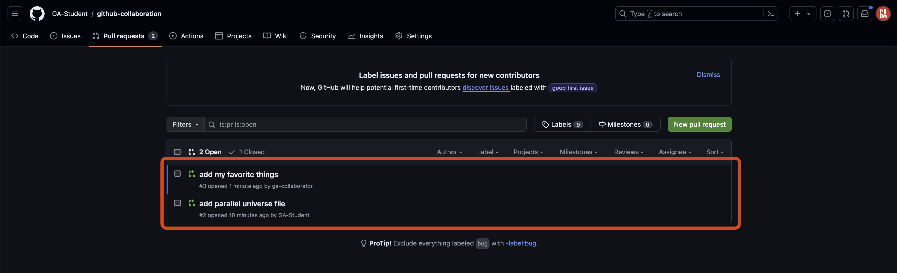

You'll be taken to a page to view the pull request on:

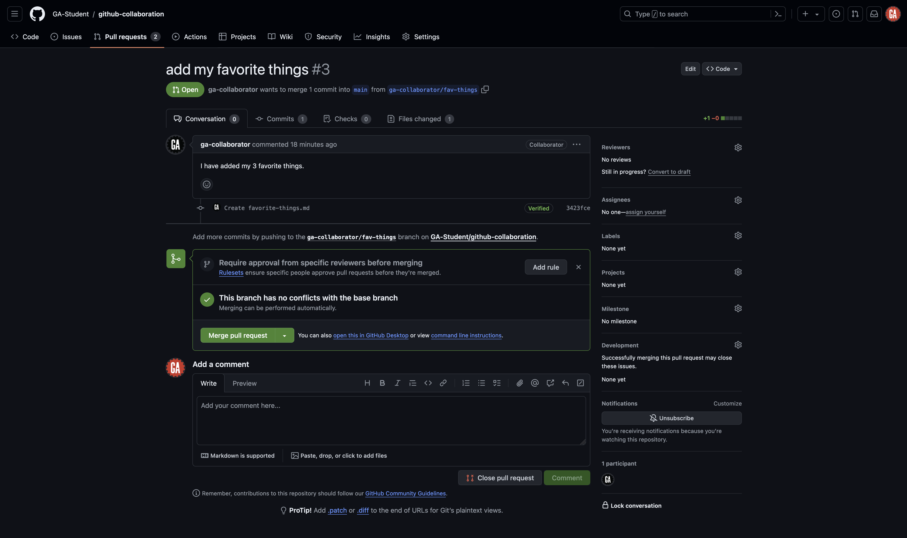

Review the pull request. If there are changes that need to be made (for example if there are merge conflicts), reach out to the person who made the pull request and have them make those changes. Make sure they inform you when those changes are complete.

If everything looks good, select the **Merge pull request** button.

Inform your team members that changes have been made so that everyone on the team can complete the **Merging locally** section below.

## Merging locally (***GitHub managers*** and ***programmers***)

> ⚠️ Both ***GitHub managers*** and ***programmers*** should complete this task.

Refer to the **[Ensure you have the most recent code (*GitHub managers* and *programmers*)](#ensure-you-have-the-most-recent-code-github-managers-and-programmers)** section to get the most updated code to the `main` branch of the ***local repo***.

After doing that, you can take two different paths. You will typically only choose one of these paths each time you've pulled code from the `main` branch of the remote repository:

- **Create a new branch**: Do this if you are ready to start working on a new feature.
- **Checkout an existing feature branch**: Do this if you have paused work on a feature and still have more work to do with it.

See the sections below for more details on what action to take for each path.

### Create a new branch

Use the same command you used to create a branch before:

```bash
git branch <feature-branch-name>
```

> 🚨 Replace `<feature-branch-name>` (including the `<` and `>`) in the above command with an appropriate branch name identifying the feature that the branch implements.

You can now do work in this branch and continue contributing as normal.

### Checkout an existing feature branch

Checkout the existing feature branch:

```bash
git checkout <feature-branch-name>
```

> 🚨 Replace `<feature-branch-name>` (including the `<` and `>`) with the name of the branch you've been working in.

Bring the latest code into the feature branch so that you can use it:

```bash
git merge main
```

This command brings the changes in the main branch into your feature branch.

## Fixing merge conflicts (***GitHub managers*** and ***programmers***)

> ⚠️ Both ***GitHub managers*** and ***programmers*** should complete this task.

Refer to the **[Ensure you have the most recent code (*GitHub managers* and *programmers*)](#ensure-you-have-the-most-recent-code-github-managers-and-programmers)** section to get the most updated code to the `main` branch of the ***local repo***.

Whether you are a programmer or a GitHub manager, the `main` branch of your ***local repo*** will now contain the same code as the `main` branch of the ***GitHub manager's remote repo***.

Checkout the existing feature branch:

```bash
git checkout <feature-branch-name>
```

> 🚨 Replace `<feature-branch-name>` (including the `<` and `>`) with the name of the branch that is currently unable to merge with the `main` branch.

Bring the latest code into the feature branch so that you can use it:

```bash
git merge main
```

This command brings the changes in the main branch into your feature branch. Or it would, but you'll notice there is an error in your terminal. Yours will look different than this - this is just an example:

```plaintext
Auto-merging <file>
CONFLICT (add/add): Merge conflict in <file>
Automatic merge failed; fix conflicts and then commit the result.
```

The error message points out a merge conflict. To proceed, we need to fix those conflicts and then commit the result.

Before going any further, close any open file tabs in VS Code and run the `git status` command, and let's observe what we see.

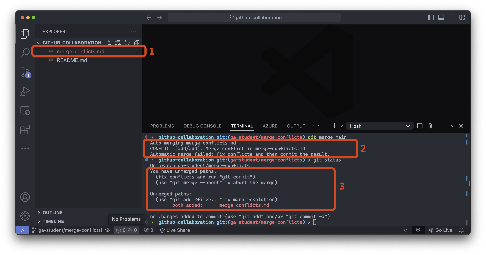

1. **File explorer**: The VS Code file explorer marks any file with merge conflicts using red/orange text and an `!` to the right of the file name.
2. **Merge error message**: Informs us that the automatic merge failed and the specific files it failed for.
3. **The output of `git status`**: Informs us we have unmerged paths (the merge was unsuccessful).

Once, we've identified the problem files, open each one and fix it the conflicts.

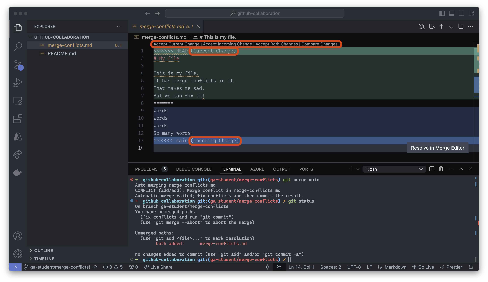

VS Code is helping us here. There are buttons above line one that are shortcuts to resolving this conflict. We can quickly accept the current change, accept the incoming change, or accept both changes. You can also take a more nuanced approach and change the text directly to resolve the conflict manually.

> 🚨 Be cautious about the changes made here - sometimes, this process can introduce bugs into your code that you must resolve manually!

After you've resolved the merge conflict, you should add, commit, and push the branch to ***your remote repo*** on GitHub. The GitHub manager should now be able to merge the pull request!

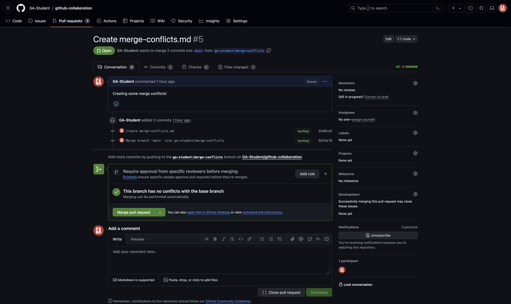
