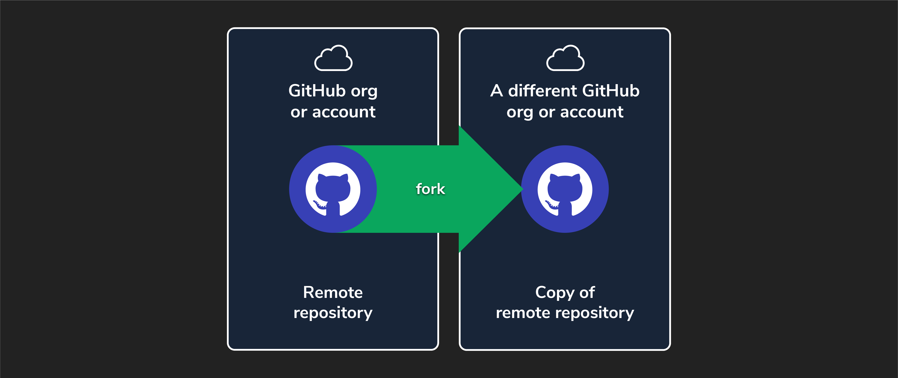
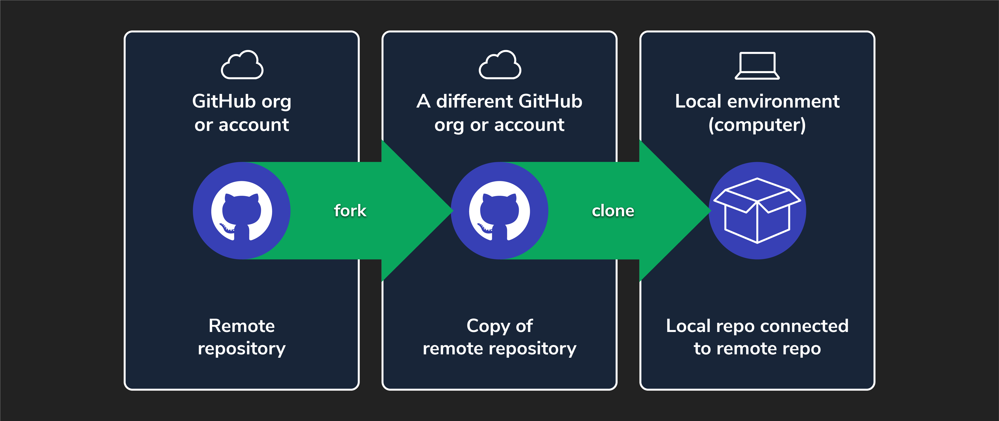

<h1>
  <span class="headline">GitHub Collaboration</span>
  <span class="subhead">Fork Method Forking</span>
</h1>

**Learning objective:** By the end of this lesson, students will be able to fork and clone a repository from GitHub.

## Forking

Forking on GitHub makes a copy of a repository from one GitHub account to a different GitHub account while retaining the connection between the two copies. This allows you to freely experiment with changes without affecting the original project and contribute to the original repo. Forking is commonly used when you want to contribute to an open-source project, work on a team project, or experiment with someone else's code.



> 💡 Think of repositories as folders. Forking is like making a copy of a folder on your computer. You can make changes to the copy without affecting the original folder. Forking is a powerful feature that enables collaboration, experimentation, and learning.

### Forking a repo (***programmers***)

> ⚠️ Only ***programmers*** should complete this task.

Forking can be done on any GitHub repository that allows it by following these steps.

1. **Navigate to the repository**: The GitHub manager on your team should have already sent you a URL to access the ***GitHub manager's remote repo***. Open your browser and navigate there now.

2. **Fork the repo**: Select the **Fork** button near the top right corner of the page, as indicated by the red outline below.

   

3. **Choose where to create the fork**: You'll be taken to a **Create a new fork** page. From here, ensure you are the owner of the repo in the dropdown outlined in red, and then select the **Create fork** button outlined towards the bottom of the page. Typically, when you fork a repo, you'll create the fork in your personal account and give it the same name as the original repo, as shown below.

   

After completing the above steps, you'll be taken to the forked repo on your account. Through the rest of this lecture, we'll refer to this repo as the ***programmer's remote repo***. Note the **forked from** text outlined in red below, indicating that this repo was forked from another repo (the ***GitHub manager's remote repo***).

> 💡 Each programmer has their own remote repo - you'll only work in your own.


You forked the GitHub manager's repo! 🎉 Now, let's clone it down.

### Cloning a forked repo (***programmers***)

> ⚠️ Only ***programmers*** should complete this task.

We copied the `github-collaboration` repo from one GitHub account to another by forking it. The next step is to clone the forked copy (the ***programmer's remote repo***) to your local device. This process isn't any different from cloning a repo that wasn't forked.



Open your Terminal application and navigate to your `~/code/ga/lectures` directory:

```bash
cd ~/code/ga/lectures
```

> 🚨 As always, don't clone into a directory already initialized as a git repository as this will create a nested repo.

Clone the ***programmer's remote repo*** to your device. Your GitHub username should be present in the URL used in the `git clone` command, like this:

```bash
git clone https://github.com/<your-username>/github-collaboration.git
```

Replacing `<your-username>` (including the `<` and `>`) with your GitHub username.

Enter the new `github-collaboration` directory. We'll refer to this as the ***programmer's local repo***.

```bash
cd github-collaboration
```

Finally, open it in VS Code:

```bash
code .
```

## How are forking and cloning different?

- Forking creates a copy of a repository in your **GitHub account**. This repository is the ***programmer's remote repo***.
- Cloning downloads a repository from GitHub to your **local machine**, enabling you to work on the code. This repository is the ***programmer's local repo***.

While forking and cloning are typically done in sequence, it's important to understand that they serve different purposes. You can fork a repository without cloning it, and you can clone a repository without forking it.

> 🧠 Repository owners can control whether others can fork and clone their repositories. Some repositories may not allow forking or cloning.
