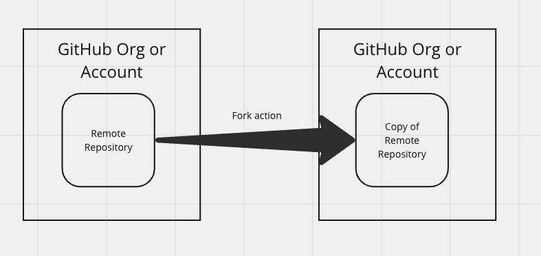
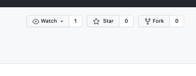
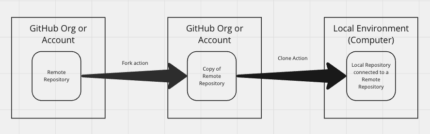
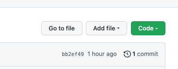

# ![[tktk Module Name] - tktk Microlesson Name](./assets/hero.png)

**Learning objective:** By the end of this lesson, students will be able to fork and clone a repository from Github.

## Why Forking and Cloning?

Forking and cloning are essential Git operations that allow you to copy a repository from GitHub to your local machine. These operations are commonly used when you want to contribute to an open-source project, work on a team project, or experiment with someone else's code. Let's dive into the details of forking and cloning.

## Forking a Repository

Forking a repository, commonly known as "forking a repo," is the process of creating a personal copy of someone else's project on GitHub. This allows you to freely experiment with changes without affecting the original project. Essentially, a fork is a snapshot of the original repository at the time you perform the fork operation.

tktk Hunter - Can you make this pretty?


> Think of repositories as folders. Forking is like making a copy of a folder on your computer. You can make changes to the copy without affecting the original folder. Forking is a powerful feature that enables not only collabroation but also experimentation and learning.

### How to

1. **Navigate to the Repository**: For this lesson we will navigate to [this](tktk-make and link starter repo) repository, but forking can be done on any repository on GitHub.

2. **Click the 'Fork' Button**: Located usually at the top-right corner of the repository's page, clicking this button will create a copy of the repository in your GitHub account.

tktk Hunter - this is the screen shot from the old content. 


3. **Choose where you want to create the fork**: Usually your personal account.

That's it! 🎉 Now let's clone it down.

### Cloning a Forked Repository

Cloning a forked repository involves creating a local copy of a repository that you've previously forked from someone else's project on GitHub. Once a repository is forked to your GitHub account, it still lives in the cloud. Cloning that forked repository downloads it onto your local machine, enabling you to work on the project locally in vscode.

tktk Hunter - Can you make this pretty?


1. **Find the Repository URL**: Navigate to your forked repository on GitHub. Locate the "Code" button and copy the URL displayed. This URL is used by Git to clone the repository.



2. **Open Terminal**: Open the terminal on your local machine and navigate to the folder where you want to store the cloned repository.

> 🚨 When you clone a repository, a directory (matching the repository’s name) will be created automatically. It’s important that you don’t create an additional directory locally, as that may cause issues/confusion later on down the road.

3. **Run the Clone Command**: Execute the `git clone` command followed by the repository URL. The syntax is `git clone [URL]`.

```bash
git clone https://github.com/your-username/tktk-update-this.git
```

4. **Navigate to the Project Folder**: After cloning, a local directory matching your forked repository will be created. Navigate into this directory to view files or to start coding.

```bash
cd forked-repo
```

5. **Start Working**: You can now begin making changes, creating new branches, committing your changes, and pushing them back to your forked repository on GitHub.

## How are Forking and Cloning different?

- Forking creates a copy of a repository in your **GitHub account**.
- Cloning downloads a repository from GitHub to your **local machine**, enabling you to work on the code.

While forking and cloning are done in sequence, it's important to understand that they serve different purposes. Also it's important to remember that you can fork a repository without cloning it, you can clone a repository without forking it.

> 🧠 The ability to allow others to fork and clone their repositories is controlled by the repository owner. Some repositories may not allow forking or cloning, while others may allow forking but not cloning.
